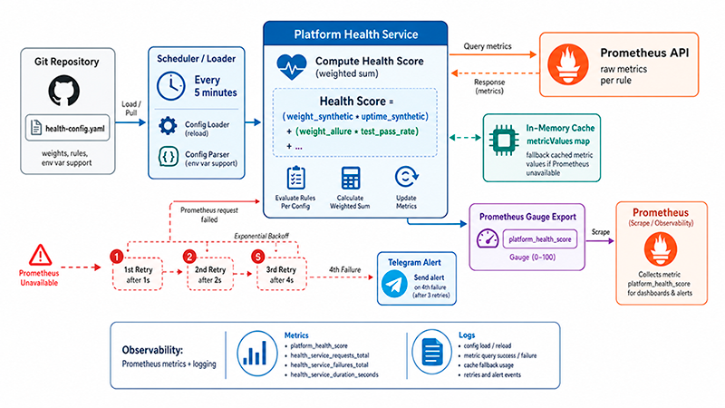

# Health score calculator

## Калькулятор "здоровья" сервиса или продукта



## Сервис, который:

1. раз в 5 минут читает конфиг из Git (`health-config.yaml` с весами и правилами).

2. через Prometheus API запрашивает сырые метрики по каждому правилу.

3. Вычисляет общий Health Score как взвешенную сумму `(weight_synthetic * uptime_synthetic) + (weight_allure * test_pass_rate) + ....`

4. экспортирует результат как gauge `platform_health_score` в формате Prometheus.

5. использует in-memory кэш (значения метрик хранятся в metricValues map) на случай недоступности Prometheus.

6. в случае недоступности источника метрик повторяет запросы три раза (ретрай с экспоненциальным бэк-оффом) и на четвертый отправляет алерт в Telegram.

7. поддержка переменных окружения в конфиге

8. наблюдаемость: Метрика Prometheus + логирование

  

## Подробнее:

### 1. Структуры данных:

-  `Config` - загружает YAML конфиг с весами метрик и настройками

-  `PrometheusResponse` - для парсинга JSON ответов от Prometheus API

  

### 2. Prometheus метрики:

-  `platform_health_score` - основная метрика здоровья

-  `health_calculator_metrics_fetched_total` - счетчик успешных запросов

-  `health_calculator_metrics_failed_total` - счетчик неудачных запросов

-  `health_calculator_calculation_duration_seconds` - гистограмма времени расчетов

  

### 3. Основные алгоритмы:

- ретраи: 3 попытки с exponential backoff (1s, 2s, 3s)

- нормализация: Приведение всех метрик к диапазону 0-1

- взвешенная сумма: `totalScore += normalizedValue * metric.Weight`

- пропорциональная корректировка: если часть метрик недоступна

- валидация: проверка суммы весов = 1.0

  

### 4. Graceful shutdown:

- обработка `SIGINT`/`SIGTERM` сигналов

- отмена контекста для остановки горутин

- 10-секундный timeout для завершения HTTP соединений

  

### 5. Circuit Breaker:

Защищает сервис от каскадных сбоев при недоступности Prometheus:

- **Состояния:** Closed (норма), Open (блокирует запросы), Half-Open (проверяет восстановление)
- **Настройки:** max_failures=3, reset_timeout=30s (настраивается в config)
- **Поведение при открытии:** возвращает fallback значение 0.5 для метрик
- **Мониторинг:** метрика `health_calculator_circuit_breaker_tripped_total`
- **Endpoint для мониторинга:** `/circuit-breaker` - показывает текущее состояние

### 6. Graceful Degradation:

Обеспечивает непрерывную работу при частичной недоступности метрик:

- **Кэширование:** TTL-based кэш успешных значений (по умолчанию 5 минут)
- **Fallback стратегии:** zero, neutral, average, last_known (настраивается)
- **Фактор деградации:** плавное снижение health score до 30% при проблемах
- **Мониторинг:** метрики `health_calculator_degraded_mode` и `health_calculator_fallback_used_total`
- **Интеграция:** работает совместно с circuit breaker

### 7. Health checks:

- проверяет что расчеты выполняются регулярно (<10 минут)
- возвращает JSON с деталями статуса
- показывает degraded статус при использовании fallback

### 8. Rate Limiting:

Защищает сервис от перегрузки и злоупотреблений:

- **Leaky bucket алгоритм** с настраиваемыми лимитами
- **Уровни лимитов:** глобальные и per-IP для разных endpoints
- **Whitelist:** IP адреса без лимитов (localhost по умолчанию)
- **Мониторинг:** метрики `health_calculator_rate_limit_exceeded_total` и `health_calculator_active_rate_limit_clients`
- **HTTP 429:** graceful обработка превышения лимитов с JSON ошибкой

### 9. Безопасность:

- таймауты на HTTP запросы
- ReadOnly монтирование конфига
- обработка ошибок на всех уровнях

  
 #### Сервис будет доступен на порту 8080 с endpoints:

-   `/metrics` - Prometheus метрики
-   `/health` - health check для Kubernetes
-   `/circuit-breaker` - статус circuit breaker
-   `/` - простой status page

## Запуск сервиса

### Локально

1. Установка зависимостей:
```bash
go mod download
```

2. Создание конфигурационного файла:
```bash
cp health-config.yaml.example health-config.yaml
# Отредактируйте под вашу среду
```

3. Запуск:
```bash
# Dev
go run .

# Prod
go build -o health-calc
./health-calc
```

### В Docker

1. Сборка:
```bash
docker build -t health-calculator .
```

2. Запуск:
```bash
docker run -p 8080:8080 \
  -e TELEGRAM_BOT_TOKEN="your_token" \
  -e TELEGRAM_CHAT_ID="your_chat_id" \
  health-calculator
```

### health-config.yaml

Основные настройки:
```yaml
# Интервал обновления метрик
update_interval: "5m"

# URL Prometheus сервера
prometheus:
  url: "http://prometheus:9090"
  timeout: "30s"

# Настройки метрик с весами (должны суммироваться в 1.0)
metrics:
  - name: "cpu_usage"
    prometheus_query: "avg(100 - avg(irate(node_cpu_seconds_total{mode='idle'}[5m])) * 100"
    weight: 0.25
    min_valid_value: 0.0
    max_valid_value: 100.0
```

### Проверка работы

1. Health check:
```bash
curl http://localhost:8080/health
```

2. Получение health score:
```bash
curl http://localhost:8080/metrics | grep platform_health_score
```

3. Статус circuit breaker:
```bash
curl http://localhost:8080/circuit-breaker
```

## надо добавить:
- [x] graceful shutdown
- [x] метрики для мониторинга самого сервиса
- [x] хелсчек с бизнес-логикой
- [x] circuit breaker
- [ ] structured logging
- [x] graceful degradation
- [x] rate limiting
- [ ] улучшить health checks
- [ ] деплоймент
- [ ] алертинг рулз