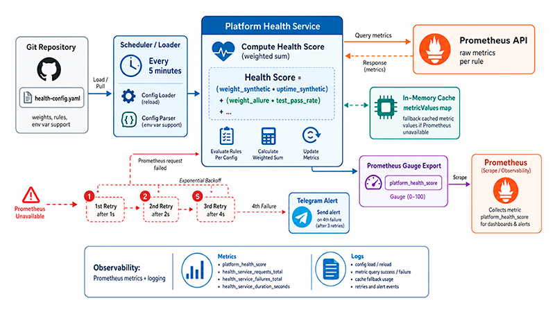

> [Русская версия](README-RU.md) · [Documentation](https://philyuchkoff.github.io/health-calc/)

# Health score calculator

## Service or product health calculator



[](https://go.dev)
[](LICENSE)
[](https://github.com/philyuchkoff/health-calc/actions/workflows/ci.yml)
[](Dockerfile)
[](https://goreportcard.com/report/github.com/philyuchkoff/health-calc)

## A service that:

1. reads config from Git (`health-config.yaml` with weights and rules) every 5 minutes.
2. queries raw metrics for each rule via Prometheus API.
3. computes the overall Health Score as a weighted sum `(weight_synthetic * uptime_synthetic) + (weight_allure * test_pass_rate) + ....`
4. exports the result as a gauge `platform_health_score` in Prometheus format.
5. uses an in-memory cache (metric values stored in metricValues map) in case Prometheus is unavailable.
6. retries requests three times (exponential backoff) if a metric source is unavailable, and sends a Telegram alert on the fourth failure.
7. supports environment variables in config
8. observability: Prometheus metrics + logging

## Details:

### 1. Data structures:

-  `Config` - loads YAML config with metric weights and settings
-  `PrometheusResponse` - for parsing JSON responses from Prometheus API

### 2. Prometheus metrics:

-  `platform_health_score` - main health metric
-  `health_calculator_metrics_fetched_total` - successful requests counter
-  `health_calculator_metrics_failed_total` - failed requests counter
-  `health_calculator_calculation_duration_seconds` - calculation time histogram

### 3. Core algorithms:

- retries: 3 attempts with exponential backoff (1s, 2s, 3s)
- normalization: Scale all metrics to the 0-1 range
- weighted sum: `totalScore += normalizedValue * metric.Weight`
- proportional adjustment: if some metrics are unavailable
- validation: check that weights sum to 1.0

### 4. Graceful shutdown:

- `SIGINT`/`SIGTERM` signal handling
- context cancellation to stop goroutines
- 10-second timeout for HTTP connection cleanup

### 5. Circuit Breaker:

Protects the service from cascading failures when Prometheus is unavailable:

- **States:** Closed (normal), Open (blocks requests), Half-Open (checks recovery)
- **Settings:** max_failures=3, reset_timeout=30s (configurable in config)
- **Behavior on open:** returns fallback value 0.5 for metrics
- **Monitoring:** metric `health_calculator_circuit_breaker_tripped_total`
- **Monitoring endpoint:** `/circuit-breaker` - shows current state

### 6. Graceful Degradation:

Ensures continuous operation when metrics are partially unavailable:

- **Caching:** TTL-based cache of successful values (default 5 minutes)
- **Fallback strategies:** zero, neutral, average, last_known (configurable)
- **Degradation factor:** smooth health score reduction to 30% during issues
- **Monitoring:** metrics `health_calculator_degraded_mode` and `health_calculator_fallback_used_total`
- **Integration:** works together with circuit breaker

### 7. Health checks:

- verifies calculations are running regularly (<10 minutes)
- returns JSON with status details
- shows degraded status when using fallback

### 8. Rate Limiting:

Protects the service from overload and abuse:

- **Leaky bucket algorithm** with configurable limits
- **Limit levels:** global and per-IP for different endpoints
- **Whitelist:** IP addresses without limits (localhost by default)
- **Monitoring:** metrics `health_calculator_rate_limit_exceeded_total` and `health_calculator_active_rate_limit_clients`
- **HTTP 429:** graceful handling of rate limit exceeded with JSON error

### 9. Security:

- HTTP request timeouts
- ReadOnly config mounting
- error handling at all levels

   
 #### The service will be available on port 8080 with endpoints:

-   `/metrics` - Prometheus metrics
-   `/health` - health check for Kubernetes (liveness probe)
-   `/ready` - readiness probe for Kubernetes
-   `/circuit-breaker` - circuit breaker status
-   `/` - simple status page

## Running the service

### Locally

1. Install dependencies:
```bash
go mod download
```

2. Edit configuration file:
```bash
cp health-config.yaml health-config.yaml.bak
# Edit health-config.yaml for your environment
```

3. Run:
```bash
# Dev
go run .

# Prod
go build -o health-calculator
./health-calculator
```

### In Docker

1. Build:
```bash
docker build -t health-calculator .
```

2. Run:
```bash
docker run -p 8080:8080 \
  -e TELEGRAM_BOT_TOKEN="your_token" \
  -e TELEGRAM_CHAT_ID="your_chat_id" \
  health-calculator
```

### health-config.yaml

Full example: [health-config.yaml](./health-config.yaml)

Main settings:
```yaml
update_interval: "5m"

prometheus:
  url: "http://prometheus:9090"
  timeout: "30s"

circuit_breaker:
  max_failures: 3
  reset_timeout: "30s"

graceful_degradation:
  enable_cache: true
  cache_ttl: "5m"
  max_age: "10m"
  fallback_strategy: "neutral"

rate_limit:
  enabled: true
  global_rate:
    "/metrics": "100/m"
    "/health": "60/m"
  per_ip_rate:
    "/health": "10/m"
  whitelist:
    - "127.0.0.1"

metrics:
  - name: "synthetic_uptime"
    prometheus_query: 'avg(synthetic_check_success{environment="production"})'
    weight: 0.4
    min_valid_value: 0.0
    max_valid_value: 1.0
```

### Verification

1. Health check:
```bash
curl http://localhost:8080/health
```

2. Get health score:
```bash
curl http://localhost:8080/metrics | grep platform_health_score
```

3. Circuit breaker status:
```bash
curl http://localhost:8080/circuit-breaker
```

## Implemented:
- [x] graceful shutdown
- [x] service self-monitoring metrics
- [x] health check with business logic (/health + /ready)
- [x] circuit breaker
- [x] structured logging
- [x] graceful degradation
- [x] rate limiting
- [x] Dockerfile
- [x] CI (GitHub Actions)
- [x] panic recovery middleware
